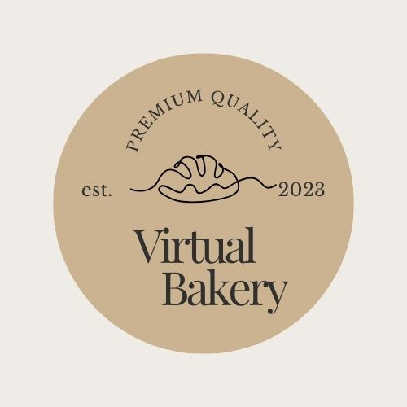

# WIRTUALNA PIEKARNIA

Zobacz projekt [Virtual Bakery](https://youtu.be/kGKepKRuDWk).

Aplikacja webowa, mająca na celu zademonstrowanie moich umiejętności pisania kodu.
Umożliwia zamawianie świeżego pieczywa oraz daty dostawy.

**Właściwości**:
- wybór pieczywa
- wybór ilości pieczywa
- wybór daty dostawy
- galeria wypieków
- panel rejestracji
- panel logowania

## 💡 Technologie

## 💡 Narzędzia

&nbsp;

## 💿 Instalacja

Projekt używa  [node](https://nodejs.org/en/) oraz [npm](https://www.npmjs.com/). Aby zainstalować wpisz w terminal: `npm i`.

&nbsp;

## 💭 Plany na przyszłość

- Poprawić warstwę wizualną- RWD
- Autoryzacja
- Wykorzystanie Bootstrap
- Połączenie formularzy z bazą danych oraz autoryzacja
- Ulepszenie kalendarza: zapisywanie daty dostawy w bazie
- Utworzenie panelu dostawcy i administratora
- Utworzenie sekcji 'o nas'
- Dodać walidację formularzy oraz kalendarza

&nbsp;

## 🙋‍♂️ Zapraszam do kontaktu
Mój email: katarzynabarska58@gmail.com

